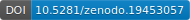

[](https://doi.org/10.5281/zenodo.14049810)

# RAT

The Result Assessment Tool (RAT) is the Free Open-Source Research Toolbox for Collecting, Analyzing and Evaluating Search Results. Identify search queries, collect the matching search results from various search systems, such as Google and Bing, analyze them, and have them evaluated by jurors. RAT can help you with all these tasks and more. It is developed by the research group Search Studies at the Hamburg University of Applied Sciences in Germany. The RAT project is funded by the German Research Foundation (DFG –Deutsche Forschungsgemeinschaft) from 2021 until 2024, project number 460676551 and from 2024 - 2028, project number 557366357.

## Repository Structure

* [rat_backend](./rat-backend): The core API and logic of the tool.
* [rat_frontend](./rat-frontend): The web-based user interface.
* [rat_storage](./rat-storage): Service for handling web data and PDF storage (Required).
* [rat_extension](./rat-extension): Browser extension for scraping search results.

## Contributors to RAT

- #### Project Lead: [Professor Dirk Lewandowski](https://searchstudies.org/team/dirk-lewandowski/) - https://github.com/dirklew
- #### Lead Software Engineer and Developer: [Sebastian Sünkler](https://searchstudies.org/team/sebastian-suenkler/) - https://github.com/sebsuenkler
- #### Software Engineer and Developer: Björn Quast - Björn Quast - https://github.com/bjoern-quast
- #### Current Frontend Developer and Assistant: [Tuhina Kumar](https://searchstudies.org/team/tuhina-kumar/) - https://github.com/tuhinak
- #### Former Frontend Developer: Nurce Yagci - https://github.com/yagci
- #### Usability and User Experience Specialist: [Sebastian Schultheiß](https://searchstudies.org/team/schultheiss/) - https://github.com/SebastianSchultheiss
- #### Student Assistant for Software Engineering: [Sophia Bosnak](https://searchstudies.org/team/sophia-bosnak/) - https://github.com/kyuja

### ⚙️ Unified RAT Installation & Deployment Manual

The Result Assessment Tool (RAT) is a free, open-source research toolbox for collecting, analyzing, and evaluating search results from systems like Google and Bing. 

This manual provides instructions for deploying the entire RAT ecosystem. You can install all applications on a single server, or split them across multiple instances to share the workload (e.g., dedicated backend scraping servers and a separate frontend UI server).

## 🏗️ Architecture Overview

The RAT ecosystem consists of four main components:
*   **Storage Service:** A microservice handling file uploads (HTML, PDFs, screenshots).
*   **Frontend (Web Interface):** A Flask application for user and study management.
*   **Backend:** A data engine managing web scraping, query sampling, and classification.
*   **Browser Extension:** A Chrome extension for client-side search engine scraping.

---

## 🛠️ 1. Global Prerequisites & Database Setup

Before installing the individual components, ensure your server environment is prepared.

*   Install **Python 3.12+**.
*   Install **Google Chrome / Chromium** (required for the Backend scraper).
*   Install **PostgreSQL**, the central database where all results are stored.

**Initialize the Database:**
Create and import the base database structure that all applications will share:
```bash
createdb -T template0 dbname
psql dbname < install_database/rat-db-install.sql
```

---

## 📦 2. Storage Service Installation

The Storage Service manages all scraped data and must be accessible by the Frontend and Backend.

### Setup Steps
*   Run the automated setup script to create the environment: `chmod +x setup.sh && ./setup.sh`.
*   Edit `storage_service.py` to set your custom `API_KEY` and `STORAGE_FOLDER`.
*   Edit `clean_orphans.py` with your PostgreSQL `DB_URI`.

### Deployment
*   Copy the service file to your system: `sudo cp rat-storage.service /etc/systemd/system/rat-storage.service`.
*   Enable and start the service: `sudo systemctl enable rat-storage.service` and `sudo systemctl start rat-storage.service`.

---

## 🖥️ 3. Frontend (Web Interface) Installation

The frontend connects to your PostgreSQL database and the Storage Service to manage studies.

### Environment Setup
*   Create and activate a virtual environment: `python3 -m venv venv_rat-frontend` then `source venv_rat-frontend/bin/activate`.
*   Install dependencies: `python -m pip install -r requirements_rat_frontend.txt`.

### Configuration
Configure your `.env` file with the following essentials:
*   **SQLALCHEMY_DATABASE_URI:** Your PostgreSQL connection string.
*   **STORAGE_BASE_URL / API_UPLOAD_KEY:** Must match the Storage Service URL and API key.
*   **MAIL_SERVER / MAIL_PORT:** Essential for user registration. The environment is set up to use **Resend** by default, but any valid SMTP provider can be used. The default server is `smtp.resend.com` on port `465`. Ensure the sender email is configured via `SECURITY_EMAIL_SENDER` (e.g., `admin@yourdomain.com`).

### Database Initialization & Deployment
*   Run the database migrations: `export FLASK_APP=rat.py` then `flask db upgrade`.
*   Create a systemd service file at `/etc/systemd/system/rat-frontend.service` using Gunicorn to run the `wsgi:app` entry point.
*   Start the service: `sudo systemctl enable rat-frontend.service` and `sudo systemctl start rat-frontend.service`.

---

## 🌐 4. Nginx Reverse Proxy & SSL Setup

If running the Frontend and Storage services on the same server, use Nginx to route traffic.

*   This configuration assumes your **Frontend** runs on port `5000` and your **Storage Service** runs on port `5001`.
*   Create an Nginx configuration mapping `/` to `[http://127.0.0.1:5000](http://127.0.0.1:5000)` (Frontend).
*   Map `/storage` to `[http://127.0.0.1:5001/](http://127.0.0.1:5001/)` (Storage Service) and increase the `client_max_body_size` to `100M` for large ZIP files.
*   Secure the installation using Certbot: `sudo certbot --nginx -d your_domain.com`.

---

## 🚀 5. Backend Engine Installation

The backend handles the heavy lifting for data acquisition. It features a Unified Controller to manage the Scraper, Query Sampler, and Classifier.

### Environment Setup
*   Create and activate the environment: `python -m venv venv_rat_backend` then `source venv_rat_backend/bin/activate`.
*   Install dependencies: `python -m pip install -r requirements_rat_backend.txt`.
*   Ensure `chromium-chromedriver` is installed on your system path.

### Configuration
Update the templates inside the `/config` directory:
*   **`config_db.ini`**: Set your PostgreSQL credentials.
*   **`config_sources.ini`**: Define your job server name and storage API key.
*   **`google-ads.yaml`**: Update with developer tokens for the Query Sampler.

### Deployment
*   Create a systemd service file (`/etc/systemd/system/rat-backend.service`) pointing `ExecStart` to `backend_controller_start.py`.
*   Ensure `ExecStop` is mapped to `backend_controller_stop.py` to safely kill Chromium processes and clear pending jobs.

---

## 🧩 6. Browser Extension Setup (Client-Side)

For user-driven data collection, RAT provides a high-performance, Manifest V3 Chrome extension.

*   Download the extension repository locally.
*   Open Google Chrome and navigate to `chrome://extensions/`.
*   Enable **Developer mode** in the top right corner.
*   Click **Load unpacked** and select the directory containing the extension's `manifest.json` file.
*   Click the extension icon to access the RAT Scraper sidepanel to create studies and manage proxies.

## RAT Extensions

The repository provides an overview of extensions created by our developer community: [rat-extensions (RAT extensions) · GitHub](https://github.com/rat-extensions)

- **Imprint Crawler**: A web crawler that is able to automatically extract legal notice information from websites while taking German legal aspects into account: [GitHub - rat-extensions/imprint-crawler · GitHub](https://github.com/rat-extensions/imprint-crawler). Developed by Marius Messer - [MnM3 · GitHub](https://github.com/MnM3)
- **Readability Score**: A Python tool that extracts the main text content of a web document and analyzes its readability: [GitHub - rat-extensions/readability-score: A python tool that extracts the main text content of a web document and analysis it readability. · GitHub](https://github.com/rat-extensions/readability-score). Developey by Mohamed Elnaggar - [mohamedsaeed21 · GitHub](https://github.com/mohamedsaeed21)
- **Forum Scraper**: An extension to extract comments from German online news services: [https://github.com/rat-software/forum-scraper](https://github.com/rat-extensions/forum-scraper). Developed by Paul Kirch - [g1thub-4cc0unt · GitHub](https://github.com/g1thub-4cc0unt)
- **EI_Logger_BA**: A browser extension for conducting interactive information retrieval studies. With this extension, study participants can work on search tasks with search engines of their choice and both the search queries and the clicks on search results are saved: [GitHub - rat-extensions/EI_Logger_BA · GitHub](https://github.com/rat-extensions/EI_Logger_BA). Developed by Hossam Al Mustafa - [Samustafa (Hossam Al Mustafa) · GitHub](https://github.com/Samustafa)
- **Identifying affiliate links in webpages**: [GitHub - rat-extensions/Identifying-affiliate-links-in-webpages: A python tool that extracts all affiliate links of a web document and scores this webpage according to its number and prominence of affiliate links. Database: · GitHub](https://github.com/rat-extensions/Identifying-affiliate-links-in-webpages). Developed by Philipp Krueger - [PhilippUDE · GitHub](https://github.com/PhilippUDE)
- **App Reviews Scraper**: [GitHub - rat-extensions/app-reviews-scraper: As a part of my Bachelor thesis I developed these app reviews scrapers, that will visit designated URLs of a set of applications and export the scraped reviews and relevant information. This is to be served as an extension to the Result Assessment Tool (RAT) and explicitly for research purposes only. · GitHub](https://github.com/rat-extensions/app-reviews-scraper). Developed by Tanveer Ahmed - [https://github.com/PhilippUDE](https://github.com/tanveerx/)
- **Visualizations of IR measures**: [GitHub - rat-extensions/ir-evaluation: Visualizations of IR measures · GitHub](https://github.com/rat-extensions/ir-evaluation). Developed by Ritu Suhas Shetkar - [ritushetkar · GitHub](https://github.com/ritushetkar)
- **Scraping News Articles**: [GitHub - rat-extensions/NewsArticlesScraper: This Python tool retrieves the homepages of given news portals and scrapes the HTML text of the articles found. · GitHub](https://github.com/rat-extensions/NewsArticlesScraper). Developed by Esther von der Weiden - [EstherKuerbis · GitHub](https://github.com/EstherKuerbis/)

---

## 📜 License

GNU GENERAL PUBLIC LICENSE Version 3, 29 June 2007